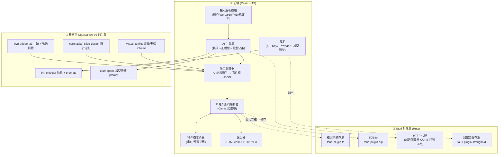

# 教學簡報產生器 — 詳細架構與資料模型設計

> 本文件是新專案 `CourseSlideGenerator` 的總體架構藍圖。
> 設計原則：**抽取 CourseFlow v2 的 AI 引擎，重建桌面外殼與所見即所得編輯器**。
> 與 CourseFlow v2 最根本的分歧：AI 不再輸出 React/TSX 程式碼，而是輸出**可序列化的物件樹 JSON**，
> 讓使用者能像 Canva 一樣拖拉編輯，並能匯出 HTML / PDF / PPTX / PNG。

---

## 1. 技術選型總覽

| 層級 | 選型 | 理由 |
|---|---|---|
| 桌面外殼 | **Tauri 2.0（Rust）** | 體積小（~10MB）、雙擊即開、免安裝、原生檔案系統存取（詳見 `03-桌面打包評估`） |
| 前端框架 | **React 19 + TypeScript（strict）+ Vite** | 沿用 CourseFlow 既有技術棧，降低移植成本 |
| 樣式 | **Tailwind CSS v4 + CSS 變數主題** | 直接沿用 23 套主題的 tokens.css |
| 編輯器畫布 | **自建 DOM/SVG 畫布**（不用 fabric.js/konva 全託管） | 物件樹要能無損匯出成 HTML 與 PPTX，需自有渲染管線 |
| 本機資料庫 | **SQLite（`tauri-plugin-sql`）** | 專案 metadata、設定、API Key（加密） |
| 本機檔案 | **檔案系統（`tauri-plugin-fs`）** | 圖片、音檔、匯出產物 |
| 狀態管理 | **Zustand + Immer** | 編輯器需要高頻、可復原（undo/redo）的不可變狀態 |
| LLM 呼叫 | 沿用 CourseFlow `packages/llm` 抽象層（擴充至 7+ 家） | OpenAI 相容介面已覆蓋多數 provider |

---

## 2. 系統分層架構



---

## 3. 端到端資料流（Pipeline）

```mermaid
flowchart LR
    A["① 貼上/匯入內容"] --> B["② 解析為純文字<br/>parse-document"]
    B --> C["③ 偵測語言 + 翻譯<br/>→ 台灣繁中"]
    C --> D["④ 格式正規化<br/>→ 最多三層大綱 + 重點標記"]
    D --> E["⑤ 逐段語意分析<br/>→ 選版型 preset (≥20種)"]
    E --> F["⑥ 版型翻譯器<br/>語意版型 → 物件樹 JSON"]
    F --> G["⑦ 套用主題 + 預設動效"]
    G --> H["⑧ 使用者看到成品簡報"]
    H --> I["⑨ 所見即所得編輯<br/>(可選)"]
    I --> J["⑩ 匯出<br/>HTML / PDF / PPTX / PNG"]

    style A fill:#e1f5ff
    style C fill:#fff3e0
    style F fill:#e8f5e9
    style I fill:#f3e5f5
    style J fill:#ede7f6
```



**重點：③④⑤⑥⑦ 全在背景完成**，使用者貼完文章後直接看到 ⑧ 成品（符合需求「翻譯與格式正規化都在背景完成」）。

---

## 4. 核心資料模型（物件樹）

> 完整 TypeScript 型別與 JSON Schema 見 `04-物件樹Schema與AI版型映射.md`。
> 這裡先說明階層關係與設計理念。

### 4.1 階層總覽

```
Project（專案）
├── meta                專案名稱、語言、建立/修改時間、版本
├── source              原文、翻譯後文字、正規化大綱（保留以利重生成）
├── theme               主題 id + 覆寫的 tokens
├── assets[]            上傳的圖片 / 音檔（指向本機檔案）
├── defaults            預設進場/出場/強調/轉場動效
└── deck（簡報本體）
    └── slides[]（每一頁）
        ├── id
        ├── layoutPreset        套用的版型 preset id（如 big-image-center）
        ├── background          顏色 / 漸層 / 圖片 / 影片
        ├── transition          頁面轉場（crossfade / wipe-right…）
        ├── notes               講者備忘 / 原始段落出處
        ├── audio               本頁背景音或旁白（可選）
        └── elements[]（物件樹，可巢狀 group）
            ├── id
            ├── type            text | list | image | shape | icon | chart | table | group | audio
            ├── transform       x, y, width, height, rotation, zIndex
            ├── style           依 type 而異（字型/顏色/對齊/邊框/陰影…）
            ├── content         文字內容 / 圖片來源 / 圖表資料…
            ├── animations[]    enter / exit / emphasis 動效
            └── children[]      （僅 group 有）
```

### 4.2 為什麼是「物件樹 JSON」而非 TSX？

| 比較項 | CourseFlow v2（TSX codegen） | 本專案（物件樹 JSON） |
|---|---|---|
| 使用者可拖拉編輯 | ❌ 不行（程式碼） | ✅ 每個物件有 transform |
| 可序列化存 SQLite | ⚠️ 需存原始碼字串 | ✅ 純 JSON |
| 匯出 PPTX | ❌ 幾乎不可能 | ✅ 物件 → pptxgenjs shape |
| 匯出 PNG | 需錄屏/截圖 | ✅ 直接渲染截圖 |
| Undo/Redo | ❌ 困難 | ✅ JSON patch 天然支援 |
| AI 重新生成單頁 | 重生整段程式碼 | ✅ 只換該 slide 的 elements |

### 4.3 座標系統

- 所有 slide 採固定設計畫布 **1920 × 1080（16:9）**。
- `transform` 用**設計像素（design-px）**，渲染時依容器等比縮放（沿用 CourseFlow 的 stage-scale 概念）。
- `zIndex` 決定圖層高低，編輯器的「上移一層/下移一層」即調整此值。

---

## 5. 三大新建子系統

### 5.1 所見即所得編輯器（Canva 式）

| 能力 | 實作方式 |
|---|---|
| 移動位置 | 拖曳改 `transform.x/y` |
| 圖層高低 | 改 `transform.zIndex`，提供「移到最上/最下、上移/下移一層」 |
| 縮放 / 調整大小 | **8 點控制手柄 + 4 邊中點**，詳見下方控點設計 |
| 旋轉 | 頂部獨立旋轉手柄 |
| 上傳圖片 | 寫入 `assets/`，新增 image element |
| 上傳音檔 | 寫入 `assets/`，掛到 slide.audio 或 audio element |
| 文字格式 | 浮動工具列：字型、字級、顏色、粗體、斜體、對齊（左/中/右） |
| 項目列表 | list element，支援 ordered / unordered |
| 復原/重做 | Zustand + Immer + JSON patch 堆疊 |
| 對齊輔助 | 拖曳時顯示智慧參考線（snap to grid / 物件邊緣對齊） |

#### 控點（Handle）設計準則 —— 要有設計感、不要醜

> 使用者明確要求：縮放/調整長寬的控點要有設計感。以下為視覺規範。

- **選取框線**：1.5px 實線，使用主題強調色（`--color-accent`），非預設藍 outline。
- **角控點（4 個）**：8×8px 白色圓角方塊（border-radius 2px），1.5px 強調色描邊，帶輕微陰影 `0 1px 3px rgba(0,0,0,.18)`；hover 放大至 10×10。
- **邊中點控點（4 個）**：6×6px 同風格，僅用於單軸縮放。
- **旋轉手柄**：選取框上方 24px 處的小圓點（直徑 10px），連一條 1px 細線到框頂，游標為旋轉圖示。
- **群組選取**：虛線框（dashed 1px）以區別單一物件的實線框。
- **手柄一律不隨物件旋轉而變形**（保持正方形視覺），透過反向旋轉補償繪製。
- **拖曳時**：顯示即時尺寸氣泡（如 `640 × 360`），半透明深底白字、圓角 4px，跟隨右下角控點。
- **禁止**：粗藍框、實心大圓點、瀏覽器原生 resize handle 外觀。

### 5.2 版型 Preset 系統（≥ 20 種）

每個 preset 是一份「**具名的物件樹樣板 + 槽位（slot）定義**」。AI 只需判斷「這段內容適合哪個 preset」，翻譯器再把內容填入槽位。範例分類：

| 類別 | preset 範例 id |
|---|---|
| 標題型 | `title-only-center`（單行大字置中）、`title-subtitle`、`section-divider` |
| 大圖型 | `big-image-center`（置中標題＋一張大圖）、`full-bleed-image`（滿版圖＋疊字）、`image-quote` |
| 圖文左右 | `text-left-image-right`、`image-left-text-right` |
| 條列型 | `bullet-list`、`numbered-steps`、`two-column-bullets` |
| 對比型 | `compare-2col`、`before-after`、`pros-cons` |
| 數據型 | `big-number-callout`（單一震撼數字）、`kpi-row`、`chart-focus`、`table-focus` |
| 流程型 | `flow-horizontal`、`timeline` |
| 引言型 | `quote-hero`、`speaker-quote` |
| 圖庫型 | `image-grid-2x2`、`gallery-strip` |

> 設計守則直接沿用 `packages/core/src/asian-slide-design.ts`：一頁一訊息、關鍵訊息 ≤13 字略偏上、內文左對齊、禁裝飾底線、禁色帶、字級階層等。

### 5.3 多格式匯出器

| 格式 | 技術 |
|---|---|
| **HTML（互動 16:9）** | 把物件樹渲染成靜態 HTML + 一支輕量 runtime（負責點擊翻頁、進場/轉場動效）。沿用 CourseFlow player 的播放控制。 |
| **PDF** | Tauri 開無頭 webview 載入 HTML → 列印成 PDF（一頁一 slide）；或前端 `print.css`。 |
| **PPTX** | `pptxgenjs`：遍歷物件樹，text→addText、image→addImage、shape→addShape、chart→addChart。動效降級為 PowerPoint 內建進場。 |
| **PNG** | 物件樹渲染到離屏容器 → Tauri 截圖 / `html-to-image`，每頁一張。 |

---

## 6. 本機儲存設計

### 6.1 SQLite schema（metadata）

```sql
-- 專案清單與設定
CREATE TABLE projects (
  id            TEXT PRIMARY KEY,
  title         TEXT NOT NULL,
  language      TEXT DEFAULT 'zh-TW',
  theme_id      TEXT,
  deck_json     TEXT NOT NULL,      -- 物件樹整包 JSON（小型專案）
  source_json   TEXT,               -- 原文 / 翻譯 / 大綱
  created_at    INTEGER NOT NULL,
  updated_at    INTEGER NOT NULL
);

-- LLM provider 設定（API Key 不存這裡，存 stronghold）
CREATE TABLE provider_settings (
  provider_id   TEXT PRIMARY KEY,   -- openai / google / openrouter / anthropic ...
  enabled       INTEGER DEFAULT 0,
  default_text_model  TEXT,
  default_image_model TEXT,
  models_cache  TEXT,               -- 上次抓到的模型清單 + 能力標籤 (JSON)
  cached_at     INTEGER
);

-- 資產索引（實體檔在檔案系統）
CREATE TABLE assets (
  id          TEXT PRIMARY KEY,
  project_id  TEXT NOT NULL,
  kind        TEXT NOT NULL,        -- image / audio
  rel_path    TEXT NOT NULL,        -- 相對 app data 目錄
  created_at  INTEGER NOT NULL
);
```

### 6.2 檔案系統佈局

```
<App Data>/CourseSlideGenerator/
├── courseslide.db                  # SQLite
├── projects/
│   └── <projectId>/
│       ├── assets/
│       │   ├── images/
│       │   └── audio/
│       └── exports/
│           ├── deck.html
│           ├── deck.pdf
│           ├── deck.pptx
│           └── png/slide-01.png ...
└── secrets/                        # stronghold 加密庫（API Key）
```

> 大型專案的 `deck_json` 若超過合理大小，可改存 `projects/<id>/deck.json` 檔案，DB 只留索引。

---

## 7. LLM Provider 與模型清單（擴充至 7+ 家）

| Provider | 介面相容性 | 模型清單來源 |
|---|---|---|
| OpenAI | 原生 | `GET /v1/models` |
| Google Gemini | OpenAI 相容 endpoint | `GET /models`（generativelanguage） |
| OpenRouter | OpenAI 相容 | `GET /api/v1/models`（含能力 metadata） |
| Anthropic | 需薄轉接層 | `GET /v1/models` |
| Groq | OpenAI 相容 | `GET /openai/v1/models` |
| Mistral | OpenAI 相容 | `GET /v1/models` |
| xAI (Grok) | OpenAI 相容 | `GET /v1/models` |
| （可續加）DeepSeek、Together… | OpenAI 相容 | `/models` |

- 使用者輸入 API Key → 透過 **Tauri HTTP 代理**（避開瀏覽器 CORS）打該 provider 的 `/models` → 快取到 `provider_settings.models_cache`。
- **能力標籤**：以 OpenRouter 的 metadata 為主；其餘 provider 用內建對照表（model id 前綴 → text/image/vision/tts 能力）補強。
- UI 以標籤呈現：`可生文字` / `可生圖片` / `可讀圖` / `可生語音`，並依任務（生大綱 vs 生插圖）過濾可選模型。

---

## 8. 與 CourseFlow v2 的對應關係速查

| 本專案模組 | 來源 | 處置 |
|---|---|---|
| 輸入解析 | `apps/web/src/lib/parse-document.ts` | 複製，去 Next 相依 |
| 翻譯 + 正規化 prompt | `packages/llm/src/prompts.ts` | 複製 + 新增翻譯 prompt |
| 版型決策概念 | `packages/craft-agent/src/prompts.ts` | 改寫成「選 preset」而非「生 TSX」 |
| 主題 | `skills/web-video-presentation/themes/` (23 套) | 直接複製 |
| 動效目錄 | `packages/wvp-bridge/src/catalog.ts` | 複製 + 補出場/強調 |
| 設計守則 | `packages/core/src/asian-slide-design.ts` | 直接複製 |
| 圖表/表格 schema | `packages/visual-config/` | 複製，接到物件樹 chart/table element |
| 播放控制 | `packages/player/` | 參考改寫成 HTML 匯出 runtime |
| WYSIWYG 編輯器 | （無） | **全新建** |
| 桌面外殼 | （無，原為 Next+Supabase+BullMQ） | **全新建（Tauri）** |
| 物件樹模型 + 翻譯器 | （無，原為 TSX codegen） | **全新建** |
| PPTX / PNG 匯出 | （無） | **全新建** |

> 詳細逐檔清單見 `02-複製與改寫清單.md`。
