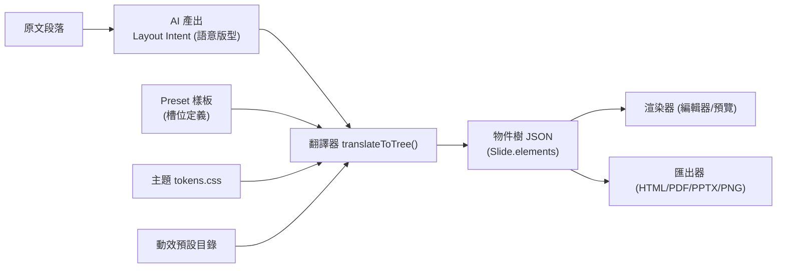

# 物件樹 JSON ↔ AI 版型輸出 Schema 設計

> 本文件定義兩個東西：
> 1. **物件樹 JSON**（編輯器 + 渲染器 + 匯出器共用的唯一真相）。
> 2. **AI 版型中間表示（Layout Intent）**：AI 不直接生物件樹，而是輸出「語意化的版型意圖」，
>    再由**翻譯器**結合 preset 樣板與主題 tokens，產生最終物件樹。
>
> 設計理念：**AI 負責「語意 + 選版型 + 填內容」，翻譯器負責「精準座標、樣式、動效」。**
> 這樣 AI 不需要算像素，輸出穩定；而精準的版面品質由確定性程式碼保證。

---

## 1. 兩層表示法總覽



---

## 2. 物件樹 JSON — 完整型別定義（TypeScript, strict）

> 全部欄位以 strict 模式撰寫，避免 `undefined` 隱患；可選欄位明確標 `?` 並在渲染端給預設值。

### 2.1 頂層：Project

```ts
export interface Project {
  schemaVersion: 1;
  id: string;
  meta: ProjectMeta;
  source: ProjectSource;
  theme: ThemeRef;
  defaults: MotionDefaults;
  assets: AssetRef[];
  deck: Deck;
}

export interface ProjectMeta {
  title: string;
  language: "zh-TW";          // 一律正規化為台灣繁中
  createdAt: number;          // epoch ms
  updatedAt: number;
}

export interface ProjectSource {
  originalText: string;       // 使用者原始輸入（任何語言）
  translatedText: string;     // 翻譯後台灣繁中
  outline: OutlineNode[];     // 最多三層大綱（保留以利重生成）
}

export interface OutlineNode {
  level: 1 | 2 | 3;           // 第1層=主題標題；2/3層=內容
  text: string;
  keyPoint: boolean;          // 是否為重點
  children: OutlineNode[];
}

export interface ThemeRef {
  id: string;                 // 對應 23 套主題之一，如 "midnight-press"
  tokenOverrides?: Record<string, string>;  // 使用者自訂覆寫的 CSS 變數
}

export interface AssetRef {
  id: string;
  kind: "image" | "audio";
  relPath: string;            // 相對 app data 的本機路徑
  width?: number;             // 圖片原始尺寸（協助等比）
  height?: number;
}
```

### 2.2 簡報與頁面：Deck / Slide

```ts
export interface Deck {
  canvas: { width: 1920; height: 1080 };   // 固定 16:9 設計畫布
  slides: Slide[];
}

export interface Slide {
  id: string;
  layoutPreset: string;       // 套用的 preset id，如 "text-left-image-right"
  background: Background;
  transition: TransitionRef;  // 進入此頁的轉場
  elements: Element[];        // 物件樹（頂層陣列，可含 group）
  notes?: string;             // 講者備忘 / 原文出處
  audio?: SlideAudio;         // 本頁背景音 / 旁白（可選）
}

export type Background =
  | { type: "solid"; color: string }                       // 可用主題 token 變數
  | { type: "gradient"; from: string; to: string; angle: number }
  | { type: "image"; assetId: string; fit: "cover" | "contain" }
  | { type: "none" };

export interface SlideAudio {
  assetId: string;
  mode: "bgm" | "narration";
  loop: boolean;
  volume: number;             // 0–1
}
```

### 2.3 物件（核心）：Element

```ts
export type Element =
  | TextElement
  | ListElement
  | ImageElement
  | ShapeElement
  | IconElement
  | ChartElement
  | TableElement
  | AudioElement
  | GroupElement;

/** 所有物件共有的基底 */
interface ElementBase {
  id: string;
  name?: string;              // 圖層面板顯示名稱
  transform: Transform;
  animations: ElementAnimation[];  // 進場/出場/強調（可多個）
  locked?: boolean;           // 編輯器鎖定
  hidden?: boolean;           // 圖層隱藏
}

export interface Transform {
  x: number;                  // design-px（0–1920）
  y: number;                  // design-px（0–1080）
  width: number;
  height: number;
  rotation: number;           // 度，順時針
  zIndex: number;             // 圖層高低
  opacity: number;            // 0–1
}
```

#### 文字

```ts
export interface TextElement extends ElementBase {
  type: "text";
  content: RichText;          // 富文字（支援 inline 粗體/斜體/顏色）
  style: TextStyle;
}

export interface RichText {
  spans: TextSpan[];          // 一行內可有多段不同樣式
}
export interface TextSpan {
  text: string;
  bold?: boolean;
  italic?: boolean;
  color?: string;             // 預設吃 style.color
}

export interface TextStyle {
  fontFamily: string;         // 預設取主題字型 token
  fontSize: number;           // design-px
  color: string;              // 可為主題 token 變數字串
  align: "left" | "center" | "right";
  lineHeight: number;
  letterSpacing?: number;
  fontWeight?: number;        // 與 span.bold 疊加
}
```

#### 列表（有序 / 無序）

```ts
export interface ListElement extends ElementBase {
  type: "list";
  ordered: boolean;           // true=有序(1.2.3) / false=無序(•)
  items: RichText[];
  style: TextStyle & { markerColor?: string; itemGap?: number };
}
```

#### 圖片

```ts
export interface ImageElement extends ElementBase {
  type: "image";
  assetId: string;            // 指向 AssetRef（本機檔）
  fit: "cover" | "contain" | "fill";
  cornerRadius?: number;
  shadow?: ShadowStyle;
}
```

#### 形狀 / 圖示

```ts
export interface ShapeElement extends ElementBase {
  type: "shape";
  shape: "rect" | "ellipse" | "line" | "arrow" | "triangle";
  fill?: string;
  stroke?: { color: string; width: number };
  cornerRadius?: number;      // 僅 rect
}

export interface IconElement extends ElementBase {
  type: "icon";
  iconId: string;             // 內建 icon set 的 id
  color: string;
}
```

#### 圖表 / 表格（接 visual-config schema）

```ts
export interface ChartElement extends ElementBase {
  type: "chart";
  config: ChartConfig;        // 直接沿用 packages/visual-config 的 Zod schema
}
export interface TableElement extends ElementBase {
  type: "table";
  config: TableConfig;        // 同上
}
```

#### 音檔（頁面層級也可放，但允許作為可視物件以便編輯）

```ts
export interface AudioElement extends ElementBase {
  type: "audio";
  assetId: string;
  mode: "bgm" | "narration";
  loop: boolean;
  volume: number;
}
```

#### 群組（巢狀）

```ts
export interface GroupElement extends ElementBase {
  type: "group";
  children: Element[];        // 物件樹的巢狀層
}
```

### 2.4 動效

```ts
export interface ElementAnimation {
  kind: "enter" | "exit" | "emphasis";
  preset: string;             // 動效目錄 id：fade-up / scale-in / blur-in / pulse / shake ...
  delay: number;              // ms，相對該頁/該物件序
  duration: number;           // ms
  easing: string;             // ease-out / cubic-bezier(...)
}

export interface MotionDefaults {
  enter: string;              // 每個新物件預設進場，如 "fade-up"
  exit: string;
  emphasis: string;
  transition: string;         // 預設頁面轉場，如 "crossfade"
}

export interface TransitionRef {
  preset: string;             // crossfade / wipe-right / push-left / cover ...
  duration: number;
  easing: string;
}
```

> 動效目錄分四類，沿用 + 擴充自 `packages/wvp-bridge/src/catalog.ts`：
> - **進場 enter**：fade-up, fade-in, scale-in, slide-left, blur-in
> - **出場 exit**（新增）：fade-out, scale-out, slide-out-right, blur-out
> - **強調 emphasis**（新增）：pulse, shake, bounce, glow, highlight-sweep
> - **轉場 transition**：crossfade, wipe-right, push-left, cover

---

## 3. AI 版型中間表示（Layout Intent）

AI 在「逐段語意分析」階段，**每一段對應一個 Slide**，輸出如下結構。**注意：AI 不給座標、不給顏色、不寫程式碼。**

### 3.1 AI 輸出 schema

```ts
export interface LayoutIntent {
  slideTitle: string;         // ≤13 字的關鍵訊息（沿用 asian-slide-design 守則）
  presetId: string;           // 從 preset 目錄選一個（見 §4）
  reason: string;             // 為何選此版型（除錯/可解釋性用）
  slots: SlotFill[];          // 把內容填進 preset 的槽位
  emphasisPoints: string[];   // 想強調的字詞（翻譯器轉成 emphasis 動效或粗體）
  suggestedImagePrompt?: string;  // 若該 preset 有圖片槽且無素材，給生圖提示
}

export interface SlotFill {
  slotName: string;           // 對應 preset 定義的槽位名（如 "title" / "image" / "bullets"）
  contentType: "text" | "richtext" | "list" | "image" | "chart" | "table";
  // 依 contentType 擇一填寫：
  text?: string;
  listItems?: string[];
  ordered?: boolean;
  chart?: unknown;            // 符合 visual-config ChartConfig
  table?: unknown;
  imageAssetId?: string;      // 若使用者已上傳；否則靠 suggestedImagePrompt
}
```

### 3.2 AI 輸出範例（單頁）

```json
{
  "slideTitle": "光合作用三要素",
  "presetId": "text-left-image-right",
  "reason": "本段在說明三個並列要素並可搭配示意圖，左文右圖最清楚",
  "slots": [
    {
      "slotName": "title",
      "contentType": "text",
      "text": "光合作用三要素"
    },
    {
      "slotName": "bullets",
      "contentType": "list",
      "ordered": false,
      "listItems": ["陽光：提供能量", "二氧化碳：碳的來源", "水：電子與氫的來源"]
    },
    {
      "slotName": "image",
      "contentType": "image"
    }
  ],
  "emphasisPoints": ["陽光", "二氧化碳", "水"],
  "suggestedImagePrompt": "簡潔的光合作用示意圖，葉片與陽光，扁平教育插畫風，無文字"
}
```

---

## 4. Preset 樣板（槽位定義）

每個 preset 是一份「**確定性的物件樹工廠**」：定義有哪些槽位、各槽位在 1920×1080 上的座標/樣式、預設動效順序。翻譯器把 `SlotFill` 灌進去。

### 4.1 Preset 定義型別

```ts
export interface LayoutPreset {
  id: string;                 // "text-left-image-right"
  name: string;               // 顯示名稱（中文）
  category: PresetCategory;
  slots: SlotDef[];
  // 給定填好的 slots，產出該頁的 elements（純函式、確定性）
  build(fills: ResolvedSlot[], ctx: BuildContext): Element[];
}

export type PresetCategory =
  | "title" | "bigImage" | "textImage" | "list"
  | "compare" | "data" | "flow" | "quote" | "gallery";

export interface SlotDef {
  name: string;               // "title" / "image" / "bullets"
  accepts: Array<"text" | "richtext" | "list" | "image" | "chart" | "table">;
  required: boolean;
  // 該槽位在設計畫布上的預設框（翻譯器用，使用者之後可自由拖動）
  frame: { x: number; y: number; width: number; height: number };
}

export interface BuildContext {
  theme: ThemeRef;
  motionDefaults: MotionDefaults;
}
```

### 4.2 ≥20 種 preset 目錄（id 對照）

| category | preset id | 描述 |
|---|---|---|
| title | `title-only-center` | 單行大字置中 |
| title | `title-subtitle` | 主標 + 副標 |
| title | `section-divider` | 章節分隔頁 |
| bigImage | `big-image-center` | 置中標題 + 一張大圖 |
| bigImage | `full-bleed-image` | 滿版圖 + 疊字（半透明襯底） |
| bigImage | `image-quote` | 大圖 + 引言 |
| textImage | `text-left-image-right` | 左文右圖 |
| textImage | `image-left-text-right` | 左圖右文 |
| list | `bullet-list` | 無序條列 |
| list | `numbered-steps` | 有序步驟 |
| list | `two-column-bullets` | 雙欄條列 |
| compare | `compare-2col` | 兩欄對比 |
| compare | `before-after` | 前後對照 |
| compare | `pros-cons` | 優缺點 |
| data | `big-number-callout` | 單一震撼數字 |
| data | `kpi-row` | 多個 KPI 並排 |
| data | `chart-focus` | 圖表為主 + 右側要點 |
| data | `table-focus` | 表格為主 |
| flow | `flow-horizontal` | 水平流程 |
| flow | `timeline` | 時間軸 |
| quote | `quote-hero` | 全幅引言 |
| gallery | `image-grid-2x2` | 2×2 圖庫 |
| gallery | `gallery-strip` | 橫向圖帶 |

> 已 ≥ 22 種，超過需求的 20 種，保留擴充空間。

### 4.3 Preset build 範例（`text-left-image-right`）

```ts
export const textLeftImageRight: LayoutPreset = {
  id: "text-left-image-right",
  name: "左文右圖",
  category: "textImage",
  slots: [
    { name: "title", accepts: ["text"], required: true,
      frame: { x: 120, y: 140, width: 820, height: 160 } },
    { name: "bullets", accepts: ["list", "text"], required: true,
      frame: { x: 120, y: 340, width: 820, height: 560 } },
    { name: "image", accepts: ["image", "chart"], required: true,
      frame: { x: 1020, y: 140, width: 780, height: 800 } },
  ],
  build(fills, ctx) {
    const els: Element[] = [];
    let z = 1;
    for (const f of fills) {
      const base = {
        id: crypto.randomUUID(),
        transform: { ...f.slot.frame, rotation: 0, zIndex: z++, opacity: 1 },
        animations: [enterAnim(ctx.motionDefaults.enter, (z - 1) * 80)],
      };
      if (f.slot.name === "title") {
        els.push({ ...base, type: "text",
          content: { spans: [{ text: f.text! }] },
          style: titleStyle(ctx.theme) });
      } else if (f.slot.name === "bullets") {
        els.push({ ...base, type: "list", ordered: f.ordered ?? false,
          items: f.listItems!.map((t) => ({ spans: [{ text: t }] })),
          style: bodyStyle(ctx.theme) });
      } else if (f.slot.name === "image") {
        els.push({ ...base, type: "image",
          assetId: f.imageAssetId ?? PLACEHOLDER, fit: "cover", cornerRadius: 16 });
      }
    }
    return els;
  },
};
```

> `titleStyle` / `bodyStyle` 從主題 tokens 取字型、字級、顏色，並套用 `asian-slide-design` 字級下限（hero ≥80px、body ≥24px 等）。

---

## 5. 翻譯器：Layout Intent → 物件樹

```ts
export function translateToTree(
  intents: LayoutIntent[],
  ctx: { theme: ThemeRef; motionDefaults: MotionDefaults; assets: AssetRef[] }
): Slide[] {
  return intents.map((intent) => {
    const preset = PRESETS[intent.presetId] ?? PRESETS["bullet-list"]; // 找不到時的安全降級
    const resolved = resolveSlots(intent.slots, preset.slots, ctx.assets);
    const elements = preset.build(resolved, ctx);
    applyEmphasis(elements, intent.emphasisPoints);   // 把強調詞轉成粗體 + emphasis 動效
    return {
      id: crypto.randomUUID(),
      layoutPreset: preset.id,
      background: defaultBackground(ctx.theme),
      transition: { preset: ctx.motionDefaults.transition, duration: 600, easing: "ease-in-out" },
      elements,
      notes: intent.reason,
    } satisfies Slide;
  });
}
```

**翻譯器負責的事（AI 不碰）：**
1. 套 preset 槽位座標 → 給每個物件精準 `transform`。
2. 從主題 tokens 取字型/顏色/字級，套 `asian-slide-design` 守則。
3. 掛預設動效（進場序、頁面轉場）。
4. preset 找不到或槽位缺漏時**安全降級**（避免 AI 亂填造成崩潰）。
5. 強調詞 → 粗體 / emphasis 動效。

---

## 6. 校驗與安全降級

- **Zod 校驗**：AI 回傳的 `LayoutIntent[]` 先過 Zod；欄位缺漏或 presetId 不存在 → 退回 `bullet-list`。
- **物件樹校驗**：最終 `Project` 也有 Zod schema，存檔/載入/匯出前一律校驗，確保跨版本相容（`schemaVersion`）。
- **品質檢查**（移植自 craft-agent checklist）：一頁一訊息、標題 ≤13 字、無純文字頁、字級階層、無裝飾底線/色帶 —— 不通過則標記提示使用者（不阻擋）。

---

## 7. 為什麼這個分層對「可編輯 + 可匯出」最關鍵

| 需求 | 由誰保證 |
|---|---|
| AI 輸出穩定、不算像素 | Layout Intent（語意層） |
| 版面精準、有設計感 | Preset build（確定性程式碼）+ asian-slide-design |
| 使用者自由拖拉編輯 | 物件樹 transform |
| 匯出 PPTX（物件對應） | 物件樹 element → pptxgenjs |
| 匯出 PNG / PDF | 物件樹 → 渲染器 → 截圖/列印 |
| AI 只重生某一頁 | 換掉該 Slide 的 elements，其餘不動 |
| 跨版本相容 | schemaVersion + Zod |

---

## 8. 一頁 cheat-sheet

```
原文段落
   │  AI（只做語意）
   ▼
LayoutIntent { slideTitle, presetId, slots, emphasisPoints }
   │  translateToTree（確定性：座標 + 主題 + 動效 + 降級）
   ▼
Slide { layoutPreset, background, transition, elements[] }
   │
   ├─► 渲染器 ─► 編輯器（拖拉/控點/圖層/undo）
   └─► 匯出器 ─► HTML / PDF / PPTX / PNG
```
